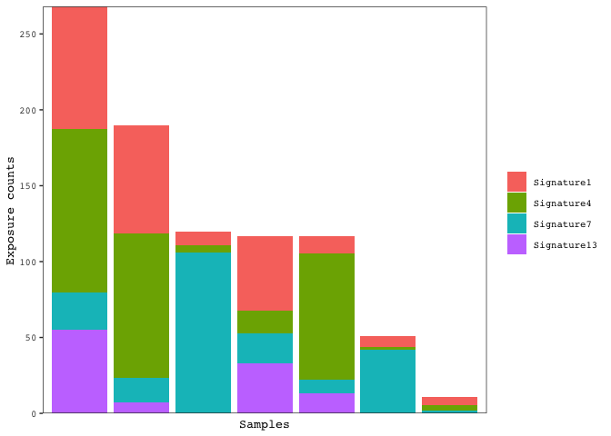
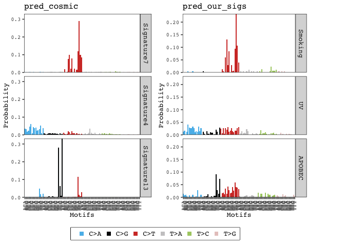
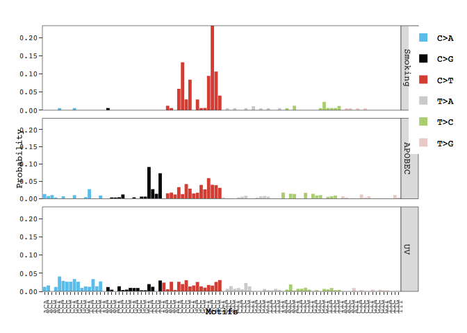

<!-- badges: start -->
[](https://github.com/campbio/musicatk/actions)
<!-- badges: end -->


Mutational Signature Comprehensive Analysis Toolkit
================

# Introduction

A variety of exogenous exposures or endogenous biological processes can
contribute to the overall mutational load observed in human tumors. Many
different mutational patterns, or “mutational signatures”, have been
identified across different tumor types. These signatures can provide a
record of environmental exposure and can give clues about the etiology
of carcinogenesis. The Mutational Signature Comprehensive Analysis
Toolkit (musicatk) has utilities for extracting variants from a variety
of file formats, contains multiple methods for discovery of novel
signatures or prediction of known signatures, as well as many types of
downstream visualizations for exploratory analysis. This package has the
ability to parse and combine multiple motif classes in the mutational
signature discovery or prediction processes. Mutation motifs include
single base substitutions (SBS), double base substitutions (DBS),
insertions (INS) and deletions (DEL).

# Installation

Currently musicatk can be installed from on Bioconductor using the
following code:

``` r
if (!requireNamespace("BiocManager", quietly=TRUE)){
    install.packages("BiocManager")}
BiocManager::install("musicatk")
```

To install the latest version from Github, use the following code:

``` r
if (!requireNamespace("devtools", quietly=TRUE)){
    install.packages("devtools")}

library(devtools)
install_github("campbio/musicatk")
```

The package can be loaded using the `library` command.

``` r
library(musicatk)
```

# Setting up a musica object

In order to discover or predict mutational signatures, we must first set
up our musica object by 1) extracting variants from files or objects
such as VCFs and MAFs, 2) selecting the appropriate reference genome 3)
creating a musica object, and 4) building a count tables for our
variants of interest.

## Extracting variants

Variants can be extracted from various formats using the following
functions:

-   The `extract_variants_from_vcf_file()` function will extract
    variants from a [VCF](https://samtools.github.io/hts-specs/) file.
    The file will be imported using the readVcf function from the
    [VariantAnnotation](https://bioconductor.org/packages/release/bioc/html/VariantAnnotation.html)
    package and then the variant information will be extracted from this
    object.
-   The `extract_variants_from_vcf()` function extracts variants from a
    `CollapsedVCF` or `ExpandedVCF` object from the
    [VariantAnnotation](https://bioconductor.org/packages/release/bioc/html/VariantAnnotation.html)
    package.
-   The `extract_variants_from_maf_file()` function will extract
    variants from a file in [Mutation Annotation Format
    (MAF)](https://docs.gdc.cancer.gov/Data/File_Formats/MAF_Format/)
    used by TCGA.
-   The `extract_variants_from_maf()` function will extract variants
    from a MAF object created by the
    [maftools](https://www.bioconductor.org/packages/release/bioc/html/maftools.html)
    package.
-   The `extract_variants_from_matrix()` function will get the
    information from a matrix or data.frame like object that has columns
    for the chromosome, start position, end position, reference allele,
    mutation allele, and sample name.
-   The `extract_variants()` function will extract variants from a list
    of objects. These objects can be any combination of VCF files,
    VariantAnnotation objects, MAF files, MAF objects, and data.frame
    objects.

Below are some examples of extracting variants from MAF and VCF files:

``` r
# Extract variants from a MAF File
lusc_maf <- system.file("extdata", "public_TCGA.LUSC.maf", package = "musicatk") 
lusc.variants <- extract_variants_from_maf_file(maf_file = lusc_maf)

# Extract variants from an individual VCF file
luad_vcf <- system.file("extdata", "public_LUAD_TCGA-97-7938.vcf", 
                         package = "musicatk")
luad.variants <- extract_variants_from_vcf_file(vcf_file = luad_vcf)

# Extract variants from multiple files and/or objects
melanoma_vcfs <- list.files(system.file("extdata", package = "musicatk"), 
                           pattern = glob2rx("*SKCM*vcf"), full.names = TRUE)
variants <- extract_variants(c(lusc_maf, luad_vcf, melanoma_vcfs))
```

    ##   |                                                                              |                                                                      |   0%  |                                                                              |==============                                                        |  20%  |                                                                              |============================                                          |  40%  |                                                                              |==========================================                            |  60%  |                                                                              |========================================================              |  80%  |                                                                              |======================================================================| 100%

## Choosing a genome

musicatk uses
[BSgenome](https://bioconductor.org/packages/release/bioc/html/BSgenome.html)
objects to access genome sequence information that flanks each mutation
which is used bases for generating mutation count tables. BSgenome
objects store full genome sequences for different organisms. A full list
of supported organisms can be obtained by running `available.genomes()`
after loading the BSgenome library. Custom genomes can be forged as well
(see
[BSgenome](https://bioconductor.org/packages/release/bioc/html/BSgenome.html)
documentation). musicatk provides a utility function called
`select_genome()` to allow users to quickly select human genome build
versions “hg19” and “hg38” or mouse genome builds “mm9” and “mm10”. The
reference sequences for these genomes are in UCSC format (e.g. chr1).

``` r
g <- select_genome("hg38")
```

## Creating a musica object

The last preprocessing step is to create an object with the variants and
the genome using the `create_musica` function. This function will
perform checks to ensure that the chromosome names and reference alleles
in the input variant object match those in supplied BSgenome object.
These checks can be turned off by setting
`check_ref_chromosomes = FALSE` and `check_ref_bases = FALSE`,
respectively. This function also looks for adjacent single base
substitutions (SBSs) and will convert them to double base substitutions
(DBSs). To disable this automatic conversion, set `convert_dbs = FALSE`.

``` r
musica <- create_musica(x = variants, genome = g)
```

    ## Checking that chromosomes in the 'variant' object match chromosomes in the 'genome' object.

    ## Checking that the reference bases in the 'variant' object match the reference bases in the 'genome' object.

    ## Warning in .check_variant_ref_in_genome(dt = dt, genome = genome): Reference
    ## bases for 6 out of 911 variants did not match the reference base in the
    ## 'genome'. Make sure the genome reference is correct.

    ## Standardizing INS/DEL style

    ## Converting 7 insertions

    ## Converting 1 deletions

    ## Converting adjacent SBS into DBS

    ## 5 SBS converted to DBS

# Creating mutation count tables

Motifs are the building blocks of mutational signatures. Motifs
themselves are a mutation combined with other genomic information. For
instance, **SBS96** motifs are constructed from an SBS mutation and one
upstream and one downstream base sandwiched together. We build tables by
counting these motifs for each sample.

``` r
build_standard_table(musica, g = g, table_name = "SBS96")
```

    ## Building count table from SBS with SBS96 schema

Here is a list of mutation tables that can be created by setting the
`table_name` parameter in the `build_standard_table` function:

-   SBS96 - Motifs are the six possible single base pair mutation types
    times the four possibilities each for upstream and downstream
    context bases (4*6*4 = 96 motifs)
-   SBS192\_Trans - Motifs are an extension of SBS96 multiplied by the
    transcriptional strand (translated/untranslated), can be specified
    with `"Transcript_Strand"`.
-   SBS192\_Rep - Motifs are an extension of SBS96 multiplied by the
    replication strand (leading/lagging), can be specified with
    `"Replication_Strand"`.
-   DBS - Motifs are the 78 possible double-base-pair substitutions
-   INDEL - Motifs are 83 categories intended to capture different
    categories of indels based on base-pair change, repeats, or
    microhomology, insertion or deletion, and length.

``` r
data(dbs_musica)
build_standard_table(dbs_musica, g, "SBS96", overwrite = TRUE)
```

    ## Building count table from SBS with SBS96 schema

    ## Warning in .table_exists_warning(musica, "SBS96", overwrite): Overwriting counts
    ## table: SBS96

``` r
build_standard_table(dbs_musica, g, "DBS78", overwrite = TRUE)
```

    ## Building count table from DBS with DBS78 schema

    ## Warning in .table_exists_warning(musica, "DBS78", overwrite): Overwriting counts
    ## table: DBS78

``` r
#Subset SBS table to DBS samples so they cam be combined
count_tables <- tables(dbs_musica)
overlap_samples <- which(colnames(count_tables$SBS96@count_table) %in%
                           colnames(count_tables$DBS78@count_table))
count_tables$SBS96@count_table <- count_tables$SBS96@count_table[, overlap_samples]
tables(dbs_musica) <- count_tables

combine_count_tables(musica = dbs_musica, to_comb = c("SBS96", "DBS78"), 
                     name = "sbs_dbs", description = "An example combined 
                     table, combining SBS96 and DBS", overwrite = TRUE)
```

``` r
annotate_transcript_strand(musica, "19", build_table = FALSE)
```

    ##   403 genes were dropped because they have exons located on both strands
    ##   of the same reference sequence or on more than one reference sequence,
    ##   so cannot be represented by a single genomic range.
    ##   Use 'single.strand.genes.only=FALSE' to get all the genes in a
    ##   GRangesList object, or use suppressMessages() to suppress this message.

``` r
build_custom_table(musica = musica, variant_annotation = "Transcript_Strand", 
                   name = "Transcript_Strand", 
                   description = "A table of transcript strand of variants", 
                   data_factor = c("T", "U"), overwrite = TRUE)
```

Different count tables can be combined into one using the
`combine_count_tables` function. For example, the SBS96 and the DBS
tables could be combined and mutational signature discovery could be
performed across both mutations modalities. Tables with information
about the same types of variants (e.g.  two related SBS tables) should
generally not be combined and used together.

Custom count tables can be created from user-defined mutation-level
annotations using the `build_custom_table` function.

# Discovering Signatures and Exposures

Mutational signature discovery is the process of deconvoluting a matrix
containing counts for each mutation type in each sample into two
matrices: 1) a **signature** matrix containing the probability of each
mutation motif in signature and 2) an **exposure** matrix containing the
estimated counts of each signature in each sample. Discovery and
prediction results are save in a `musica_result` object that includes
both the signatures and sample exposures.

``` r
result <- discover_signatures(musica = musica, table_name = "SBS96", 
                              num_signatures = 3, algorithm = "nmf", 
                              nstart = 10)
```

Supported signature discovery algorithms include:

-   Non-negative matrix factorization (nmf)
-   Latent Dirichlet Allocation (lda)

Both have built-in `seed` capabilities for reproducible results,
`nstarts` for multiple independent chains from which the best final
result will be chosen. NMF also allows for parallel processing via
`par_cores`.

To get the signatures or exposures from the result object, the following
functions can be used:

``` r
# Extract the exposure matrix
expos <- exposures(result)
expos[1:3,1:3]
```

    ##            TCGA-56-7582-01A-11D-2042-08 TCGA-77-7335-01A-11D-2042-08
    ## Signature1                 9.910392e+00                 2.963251e-09
    ## Signature2                 2.860983e-07                 1.610374e+02
    ## Signature3                 1.800896e+02                 1.069626e+02
    ##            TCGA-94-7557-01A-11D-2122-08
    ## Signature1                 1.030442e+00
    ## Signature2                 1.159696e+02
    ## Signature3                 2.886599e-13

``` r
# Extract the signature matrix
sigs <- signatures(result)
sigs[1:3,1:3]
```

    ##           Signature1  Signature2   Signature3
    ## C>A_ACA 7.561675e-11 0.013628647 1.254321e-02
    ## C>A_ACC 7.684567e-11 0.007898625 1.641794e-02
    ## C>A_ACG 8.596657e-11 0.010725916 8.347563e-11

# Plotting

## Signatures

Barplots showing the probability of each mutation type in each signature
can be plotted with the `plot_signatures` function:

``` r
plot_signatures(result)
```

<!-- -->

By default, the scales on the y-axis are forced to be the same across
all signatures. This behavior can be turned off by setting
`same_scale = FALSE`. Signatures can be re-named based on prior
knowledge and displayed in the plots:

``` r
name_signatures(result, c("Smoking", "APOBEC", "UV"))
plot_signatures(result)
```

<!-- -->

## Exposures

Barplots showing the exposures in each sample can be plotted with the
`plot_exposures` function:

``` r
plot_exposures(result, plot_type = "bar")
```

<!-- -->

The proportion of each exposure in each tumor can be shown by setting
`proportional = TRUE`:

``` r
plot_exposures(result, plot_type = "bar", proportional = TRUE)
```

<!-- -->

Counts for individual samples can also be plotted with the
`plot_sample_counts` function:

``` r
samples <- sample_names(musica)
plot_sample_counts(musica, sample_names = samples[c(3,4,5)], table_name = "SBS96")
```

<!-- -->

## Comparison to external signatures (e.g. COSMIC)

A common analysis is to compare the signatures estimated in a dataset to
those generated in other datasets or to those in the [COSMIC
database](https://cancer.sanger.ac.uk/cosmic/signatures). We have a set
of functions that can be used to easily perform pairwise correlations
between signatures. The `compare_results` functions compares the
signatures between two `musica_result` objects. The `compare_cosmic_v2`
will correlate the signatures between a `musica_result` object and the
SBS signatures in COSMIC V2. For example:

``` r
compare_cosmic_v2(result, threshold = 0.75)
```

<!-- -->

    ##      cosine x_sig_index y_sig_index x_sig_name  y_sig_name
    ## 1 0.9733111           1           7    Smoking  Signature7
    ## 4 0.7906308           3           4         UV  Signature4
    ## 2 0.7720306           1          11    Smoking Signature11
    ## 3 0.7547538           1          30    Smoking Signature30

In this example, our Signatures 1 and 2 were most highly correlated to
COSMIC Signature 7 and 4, respectively, so this may indicate that
samples in our dataset were exposed to UV radiation or cigarette smoke.
Only pairs of signatures who have a correlation above the `threshold`
parameter will be returned. If no pairs of signatures are found, then
you may want to consider lowering the threshold. The default correlation
metric is the cosine similarity, but this can be changed to using 1 -
Jensen-Shannon Divergence by setting `metric = "jsd"` Signatures can
also be correlated to those in the COSMIC V3 database using the
`compare_cosmic_v3` function.

# Predicting exposures using pre-existing signatures

Instead of discovering mutational signatures and exposures from a
dataset *de novo*, one might get better results by predicting the
exposures of signatures that have been previously estimated in other
datasets. We incorporate several methods for estimating exposures given
a set of pre-existing signatures. For example, we can predict exposures
for COSMIC signatures 1, 4, 7, and 13 in our current dataset:

``` r
# Load COSMIC V2 data
data("cosmic_v2_sigs")

# Predict pre-existing exposures using the "lda" method
pred_cosmic <- predict_exposure(musica = musica, table_name = "SBS96",
                               signature_res = cosmic_v2_sigs,
                               signatures_to_use =  c(1, 4, 7, 13),
                               algorithm = "lda")

# Plot exposures
plot_exposures(pred_cosmic, plot_type = "bar")
```

<!-- -->

The `cosmic_v2_sigs` object is just a `musica_result` object containing
COSMIC V2 signatures without any sample or exposure information. Note
that if `signatures_to_use` is not supplied by the user, then exposures
for all signatures in the result object will be estimated. We can
predict exposures for samples in any `musica` object from any
`musica_result` object as long as the same mutation schema was utilized.

We can list which signatures are present in each tumor type according to
the [COSMIC V2
database](https://cancer.sanger.ac.uk/cosmic/signatures_v2.tt). For
example, we can find which signatures are present in lung cancers:

``` r
cosmic_v2_subtype_map("lung")
```

    ## lung adeno

    ## 124561317

    ## lung  small cell

    ## 14515

    ## lung  squamous

    ## 124513

We can predict exposures for samples in a `musica` object using the
signatures from any `musica_result` object. Just for illustration, we
will predict exposures using the estimated signatures from
`musica_result` object we created earlier:

``` r
pred_our_sigs <- predict_exposure(musica = musica, table_name = "SBS96",
                                 signature_res = result, algorithm = "lda")
```

Of course, this example is not very useful because we are predicting
exposures using signatures that were learned on the same set of samples.
Most of the time, you want to give the `signature_res` parameter a
`musica_result` object that wss generated using independent samples from
those in the `musica` object. As mentioned above, different signatures
in different result objects can be compared to each other using the
`compare_results` function:

``` r
compare_results(result = pred_cosmic, other_result = pred_our_sigs, 
                threshold = 0.60)
```

<!-- -->

    ##      cosine x_sig_index y_sig_index  x_sig_name y_sig_name
    ## 2 0.9733111           3           1  Signature7    Smoking
    ## 1 0.7906308           2           3  Signature4         UV
    ## 3 0.7412271           4           2 Signature13     APOBEC

# Comparing samples between groups using Sample Annotations

## Adding sample annotations

We first must add an annotation to the `musica` or `musica_result`
object

``` r
annot <- read.table(system.file("extdata", "sample_annotations.txt", 
                                package = "musicatk"), sep = "\t", header=TRUE)
samp_annot(result, "Tumor_Subtypes") <- annot$Tumor_Subtypes
```

Note that the annotations can also be added directly the `musica` object
in the beginning using the same function:
`samp_annot(musica, "Tumor_Subtypes") <- annot$Tumor_Subtypes`. These
annotations will then automatically be included in any down-stream
result object.

-   **Be sure that the annotation vector being supplied is in the same
    order as the samples in the `musica` or `musica_result` object.**
    You can view the sample order with the `sample_names` function:

``` r
sample_names(result)
```

    ## [1] TCGA-56-7582-01A-11D-2042-08 TCGA-77-7335-01A-11D-2042-08
    ## [3] TCGA-94-7557-01A-11D-2122-08 TCGA-97-7938-01A-11D-2167-08
    ## [5] TCGA-EE-A3J5-06A-11D-A20D-08 TCGA-ER-A197-06A-32D-A197-08
    ## [7] TCGA-ER-A19O-06A-11D-A197-08
    ## 7 Levels: TCGA-56-7582-01A-11D-2042-08 ... TCGA-ER-A19O-06A-11D-A197-08

## Plotting exposures by a Sample Annotation

As mentioned previously, the `plot_exposures` function can plot sample
exposures in a `musica_result` object. It can group exposures by either
a sample annotation or by a signature by setting the `group_by`
parameter. Here will will group the exposures by the `Tumor_Subtype`
annotation:

``` r
plot_exposures(result, plot_type = "bar", group_by = "annotation", 
               annotation = "Tumor_Subtypes")
```

<!-- -->

The distribution of exposures with respect to annotation can be viewed
using boxplots by setting `plot_type = "box"` and
`group_by = "annotation"`:

``` r
plot_exposures(result, plot_type = "box", group_by = "annotation", annotation = "Tumor_Subtypes")
```

<!-- -->

Note that the name of the annotation must be supplied via the
`annotation` parameter. Boxplots can be converted to violin plots by
setting `plot_type = "violin"`. To compare the level of each exposure
across sample groups within a signature, we can set
`group_by = "signature"` and `color_by = "annotation"`:

``` r
plot_exposures(result, plot_type = "box", group_by = "signature", 
               color_by = "annotation", annotation = "Tumor_Subtypes")
```

<!-- -->

## Visualizing samples in 2D using UMAP

The `create_umap` function embeds samples in 2 dimensions using the
`umap` function from the
[uwot](https://cran.r-project.org/web/packages/uwot/index.html) package.
The major parameters for fine tuning the UMAP are `n_neighbors`,
`min_dist`, and `spread`. See `?uwot::umap` for more information on
these parameters.

``` r
create_umap(result = result)
```

    ## The parameter 'n_neighbors' cannot be bigger than the total number of samples. Setting 'n_neighbors' to 7.

The `plot_umap` function will generate a scatter plot of the UMAP
coordinates. The points of plot will be colored by the level of a
signature by default:

``` r
plot_umap(result = result)
```

<!-- -->

By default, the exposures for each sample will share the same color
scale. However, exposures for some signatures may have really high
levels compared to others. To make a plot where exposures for each
signature will have their own color scale, you can set
`same_scale = FALSE`:

``` r
plot_umap(result = result, same_scale = FALSE)
```

<!-- -->

Lastly, points can be colored by a Sample Annotation by setting
`color_by = "annotation"` and `annotation` to the name of the
annotation:

``` r
plot_umap(result = result, color_by = "annotation", 
          annotation = "Tumor_Subtypes", add_annotation_labels = TRUE)
```

<!-- -->

When `add_annotation_labels = TRUE`, the centroid of each group is
identified using medians and the labels are plotted on top of the
centroid.

# Use of Plotly in plotting

plot\_signatures, plot\_exposures, and plot\_umap, all have builty in
ggplotly capabilities. Simply specifying `plotly = TRUE` enables
interactive plots that allows examination of individuals sections,
zooming and resizing, and turning on and off annotation types and legend
values.

``` r
plot_signatures(result, plotly = TRUE)
```

<!-- -->

``` r
plot_exposures(result, plotly = TRUE)
```

<!-- -->

``` r
plot_umap(result, plotly = TRUE)
```

<!-- -->

# Note on reproducibility

Several functions make use of stochastic algorithms or procedures which
require the use of random number generator (RNG) for simulation or
sampling. To maintain reproducibility, all these functions should be
called using `set_seed(1)` or `withr::with_seed(seed, function())` to
make sure same results are generatedeach time one of these functions is
called. Using with\_seed for reproducibility has the advantage of not
interfering with any other user seeds, but using one or the other is
important for several functions including *discover\_signatures*,
*predict\_exposure*, and *create\_umap*, as these functions use
stochastic processes that may produce different results when run
multiple times with the same settings.

``` r
seed <- 1
reproducible_prediction <- withr::with_seed(seed, 
                                            predict_exposure(musica = musica, 
                                                         table_name = "SBS96",
                                 signature_res = result, algorithm = "lda"))
```
